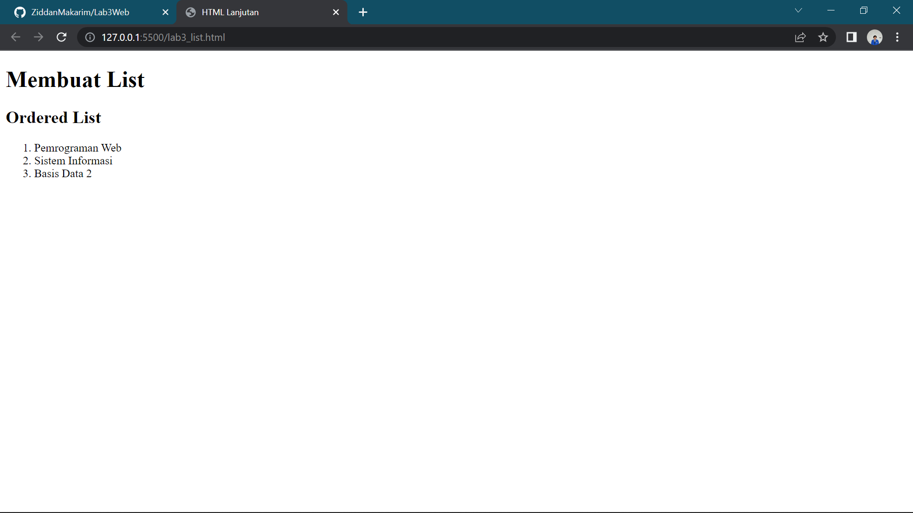
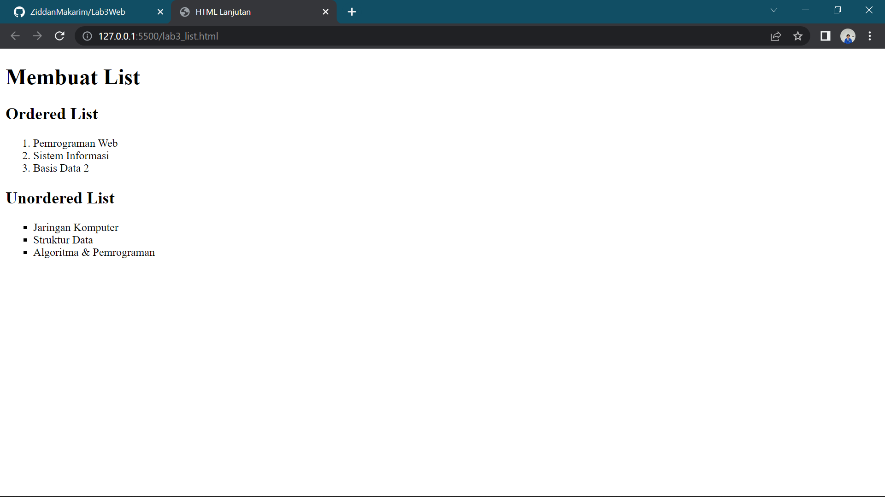
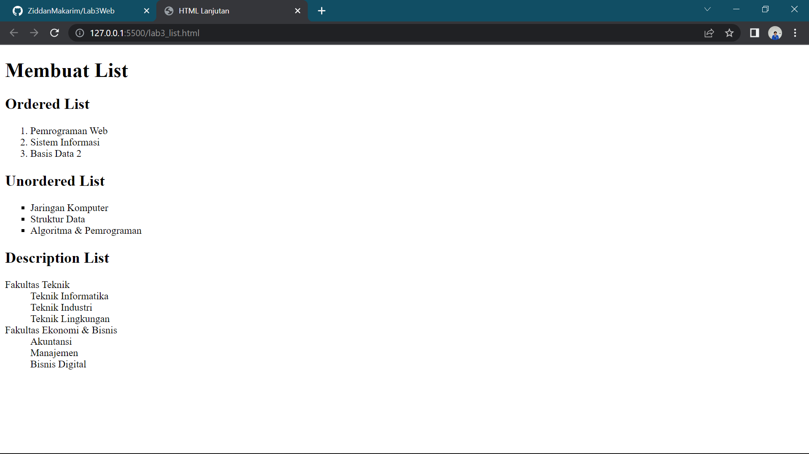
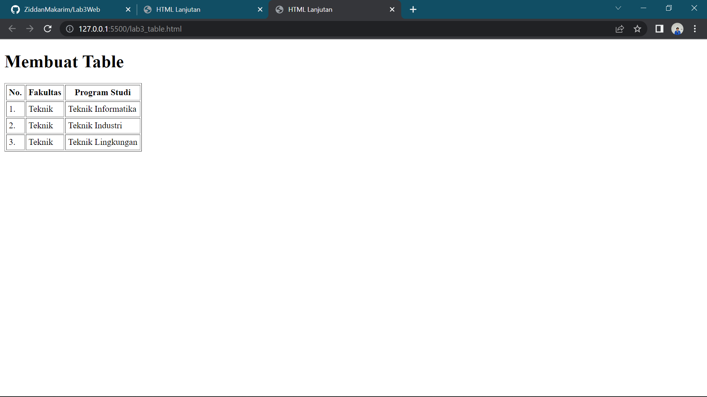
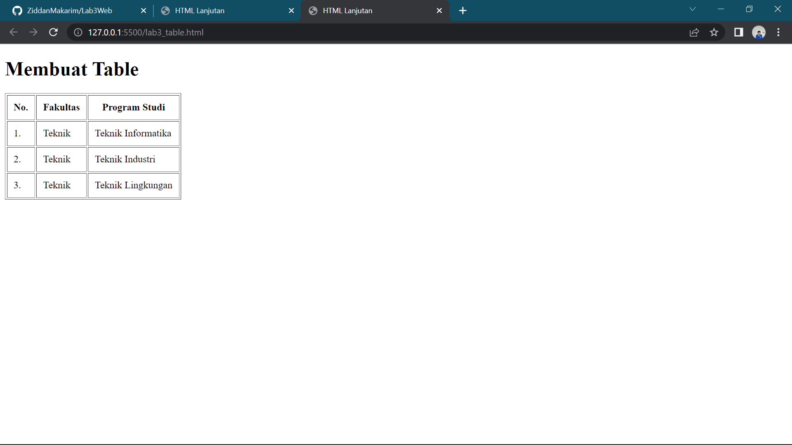
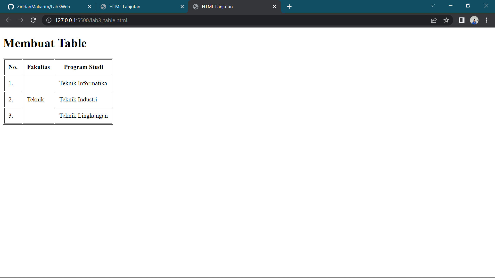
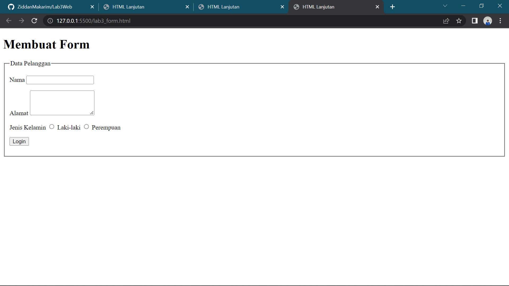
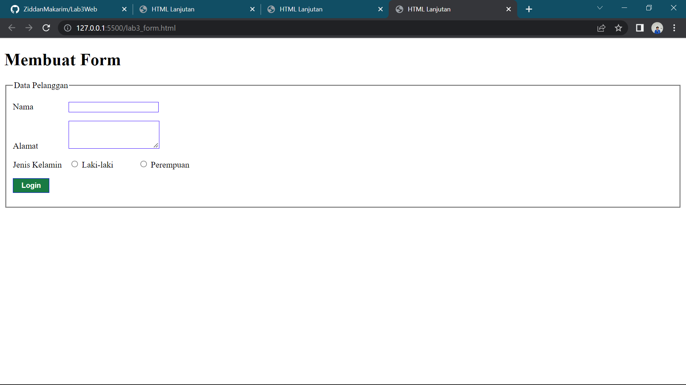

| Ziddan Makarim        | TI.20 A.1         | 
|-----------------------|-------------------|
| Pemrograman Web       | Pertemuan 4       |

## Lab3Web
Kali ini kita akan membahas tentang membuat **list** **table** dan **form** 

## 1.) Membuat Ordered List
### Hasil


Ordered list adalah list yang terurut atau tersusun secara rapih orderan menu dengan diawali tag ol.

### Contoh Coding
```html
 <header>
        <h1>Membuat List</h1>
    </header>
    <section id="ordered list">
        <h2>Ordered List</h2>
        <ol>
            <li>Pemrograman Web</li>
            <li>Sistem Informasi</li>
            <li>Basis Data 2</li>
        </ol>
    </section>
```

## 2.) Membuat Unordered List
### Hasil


Unordered list adalah list yang tidak terurut atau list yang bersifat acak dengan diawali tag ul

### Contoh Code
```html
<section id="unordered list">
        <h2>Unordered List</h2>
        <ul type="square">
            <li>Jaringan Komputer</li>
            <li>Struktur Data</li>
            <li>Algoritma & Pemrograman</li>
        </ul>
    </section>
```

## 3.) Membuat Description List
### Hasil


Description list adalah daftar deskripsi yang urutannya yaitu dl sebagai list sebuah deskripsi kemudian dt sebagai sebuah istilah dari penjelasan, sedangkan dd adalah deskripsinya atau penjelasannya.

### Contoh Coding
```html
</section>
    <section id="unordered list">
        <h2>Description List</h2>
    <dl>
        <dt>Fakultas Teknik</dt>
        <dd>Teknik Informatika</dd>
        <dd>Teknik Industri</dd>
        <dd>Teknik Lingkungan</dd>
        <dt>Fakultas Ekonomi & Bisnis</dt>
        <dd>Akuntansi</dd>
        <dd>Manajemen</dd>
        <dd>Bisnis Digital</dd>
    </dl>
    </section>
```

## 4.) Membuat Table List
### Hasil


Dalam membuat tabel urutan codingannya adalah deklarasikan dengan tag table lalu panggil tag thead  yang kemudian th untuk table head dan kemudian tbody dan td untuk table data atau penjelasan.

### Contoh Coding
```html
<!DOCTYPE html>
<html lang="en">
<head>
    <meta charset="UTF-8">
    <meta http-equiv="X-UA-Compatible" content="IE=edge">
    <meta name="viewport" content="width=device-width, initial-scale=1.0">
    <title>HTML Lanjutan</title>
</head>
<body>
    <header>
        <h1>Membuat Table</h1>
    </header>
    <table border="1" cellpadding="4" cellpadding="0">
        <thead>
            <tr>
                <th>No.</th>
                <th>Fakultas</th>
                <th>Program Studi</th>
            </tr>
        </thead>
        <tbody>
            <tr>
                <td>1.</td>
                <td>Teknik</td>
                <td>Teknik Informatika</td>
            </tr>
            <tr>
                <td>2.</td>
                <td>Teknik</td>
                <td>Teknik Industri</td>
            </tr>
            <tr>
                <td>3.</td>
                <td>Teknik</td>
                <td>Teknik Lingkungan</td>
            </tr>
        </tbody>
    </table>
</body>
</html>
```

## 5.) Menambahkan Margin dan Padding di Table
Sebelumnya saya cellpadding:"4" dan cellspadding:"0"
### Contoh Coding
```html
<table border="1" cellpadding="4" cellspadding="0">
```
Kemudian diubah menjadi contoh gambar dibawah!

### Contoh Coding
```html
<table border="1" cellpadding="10" cellspadding="0">
```

Agar terlihat lebih besar dan rapih.

## 6.) Menggabungkan Sell Data
### Hasil


Untuh menggabungkan sell data gunakan rowspan dan tentukan value untuk perubahannya.

### Contoh Coding
```html
<table border="1" cellpadding="10" cellspadding="0">
        <thead>
            <tr>
                <th>No.</th>
                <th>Fakultas</th>
                <th>Program Studi</th>
            </tr>
        </thead>
        <tbody>
            <tr>
                <td>1.</td>
                <td rowspan="3">Teknik</td>
                <td>Teknik Informatika</td>
            </tr>
            <tr>
                <td>2.</td>
                <td>Teknik Industri</td>
            </tr>
            <tr>
                <td>3.</td>
                <td>Teknik Lingkungan</td>
            </tr>
        </tbody>
    </table>
```

## 7.) Membuat Form HTML
### Hasil


Dalam membuat form perintah HTML codenya adalah form yang kemudian di ikuti input sesuai kebutuhan dalam client pembuatan.

### Contoh Coding
```html
<!DOCTYPE html>
<html lang="en">
<head>
    <meta charset="UTF-8">
    <meta http-equiv="X-UA-Compatible" content="IE=edge">
    <meta name="viewport" content="width=device-width, initial-scale=1.0">
    <title>HTML Lanjutan</title>
</head>
<body>
    <header>
        <h1>Membuat Form</h1>
    </header>
    <form action="proses.php">
        <fieldset>
            <legend>Data Pelanggan</legend>
            <p>
                <label for="nama">Nama</label>
                <input type="text" id="nama" name="nama">
            </p>
            <p>
                <label for="alamat">Alamat</label>
                <textarea name="alamat" id="" cols="3" rows="10"></textarea>
            </p>
            <p>
                <label for="jenis kelamin">Jenis Kelamin</label>
                <input type="radio" name="jk_l" id="jk_l" value="L">
                <label for="Jk_l">Laki-laki</label>
                <input type="radio" name="kelamin" id="jk_p">
                <label for="jk_p">Perempuan</label>
            </p>
            <p><input type="submit" value="Login"></p>
        </fieldset>
    </form>
</body>
</html>
```

## 8.) Membuat Style Internal CSS
### Hasil


Disini saya sedikit menambahkan file internal CSS

### Contoh Coding
```css
  <style>
        form p > label {
        display: inline-block;
        width: 100px;
        }
        form input[type="text"], form textarea {
        border: 1px solid #2f00ff;
        }
        form input[type="submit"] {
        border: 1px solid #0b07eb;
        background-color: #197a43;
        color: #ffffff;
        font-weight: bold;
        padding: 5px 15px;
        }
        </style>
```

## Pertanyaan dan Tugas

## 1.) Buatlah form yang menampilkan dropdown menu dan listbox dengan multiple selection!
